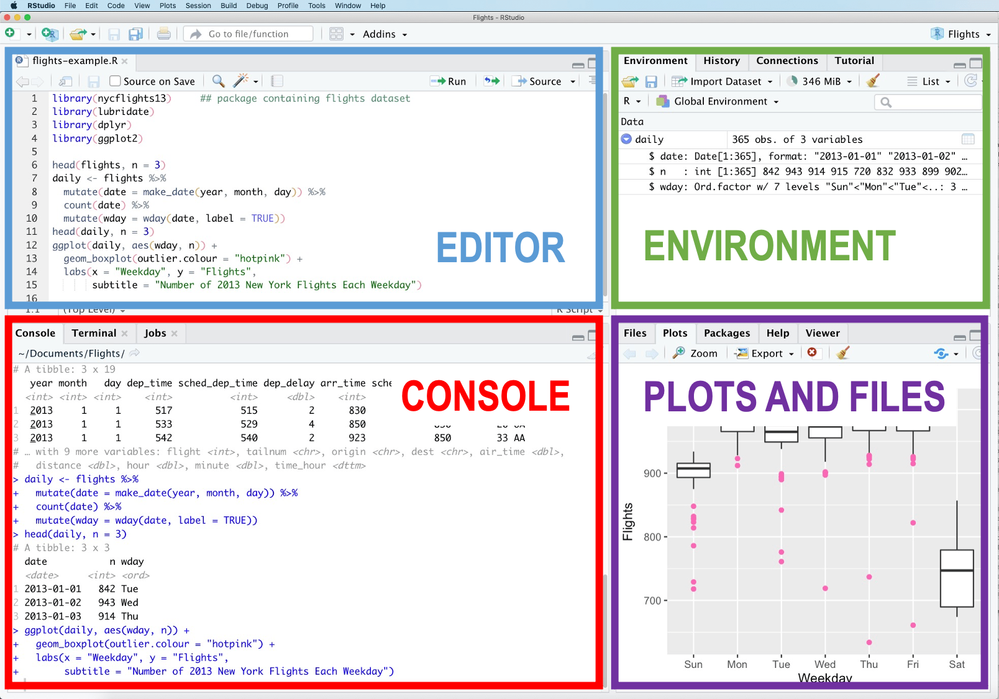

# Getting Started with RStudio

This guide explains how to get ready for the practical activities in the Summer School.

During the workshop, you will work with an **R Markdown (`.Rmd`) template** that contains the code and exercises used throughout the session.

## Step 1: Open RStudio

For the Summer School practical sessions, you will use the university computers. **R** and **RStudio** are already installed, so you do not need to install any software.

1.  Log in to the computer using your university username and password.

2.  Open the **Start Menu**.

3.  Type **RStudio** into the search bar.

4.  Click **RStudio** to open the application.

## Step 2: Download the Student Template

Download the **[Day 1 Student Template (.Rmd)](student-templates/Day1_Student_Template.Rmd).**

Save it in a folder where you can easily find it again, for example:

```         
Documents
└── Summer School 2026
      └── Session1_student_template_Clinical_Trial.Rmd
```

Keeping all your files in one folder makes them easier to locate during the workshop.

## Step 3: Open the Template

In RStudio, select:

**File → Open File...**

Navigate to your **Summer School 2026** folder and open the downloaded `.Rmd` file.

The template should now appear in the **Editor** (top-left pane).

# The RStudio Interface

You only need to know about two parts of RStudio to begin with.

- **Editor (top left)** – where you will read the template and edit your code.

- **Console (bottom left)** – where R runs the code and displays the results.

  {width="699"}

During today's session we will also look at:

- **Environment (top right)** – shows the datasets and objects you create.

- **Plots (bottom right)** – displays the graphs you produce.

# Working with the Template

Throughout the workshop you will work in the `.Rmd` template.

As we progress through the session, you will:

- run the code provided;

- observe the output produced by R;

- answer short questions;

- complete small coding exercises; and

- save your work as you go.

By the end of the workshop, you will have a completed R Markdown document that you can keep as a reference.

# Running Code

The template is divided into **code chunks**.

For example:

```{r}

2 + 2
```

To run a code chunk:

- click the green **Run** button in the top-right corner of the chunk; or

- place your cursor inside the chunk and press **Ctrl + Shift + Enter** (Windows) or **Cmd + Shift +Enter** (Mac).

The output will appear immediately below the code chunk.


::: {.callout-note}
### Next step

Now that RStudio is ready, return to the main activity:

**➡ [Exploring a Clinical Trial Dataset](exploring-clinical-trial-dataset.html)**
:::
